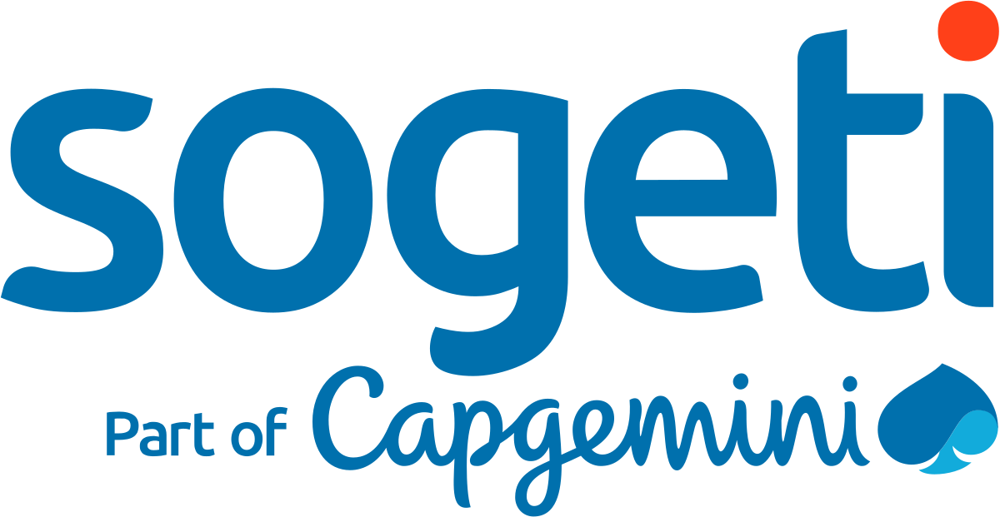

# Les tests WEB avec Cypress sur Open Cruise

Le projet est composé de plusieurs dossiers  qui seront détaillés :

* [ ] Page

*Sous ce dossier sont regroupés les les locators qui nous permettront d'identifiés les données du Web.*

* [ ] Step

*Les données à ce niveau sont obtenues à travers un appel des données du dossier page.*

* [ ] Test

*C'est à ce niveau que sont élaborés les différents tests. Avant tout test, il y a eu un import des pages précédemment cités.*

* [ ] Fixtures

*A ce niveau sont maintenus et conserver nos données de tests pour l'automatisation.*

* [ ] Autres installations

A ce niveau, il

