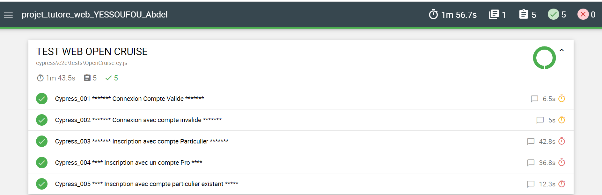
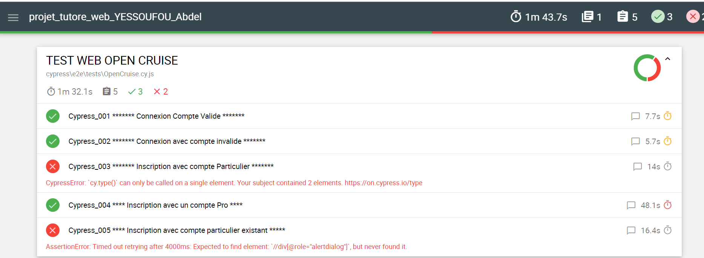

# Exécution des Tests

Les tests sont effectués sur l'environnement OK qui est l'environnement par défaut. 

Néamoins, ils peuvent aussi être effectuer sur le deuxième environnement qui est l'environnement KO.

Pour switcher d'un environnement à un autre, on peut se référer aux commandes stockés dans notre Package.json

Avec l'environnement par défaut, nos tests sont tous passés.

Ci-joint une capture d'écran

Ce qui n'est pas le cas avec l'environnement KO.

Sur l'environnement Ko, nous avons trois tests qui sont passés sur cinq.

